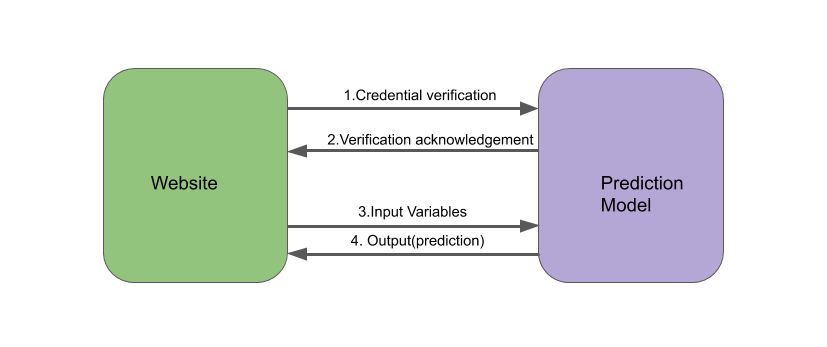
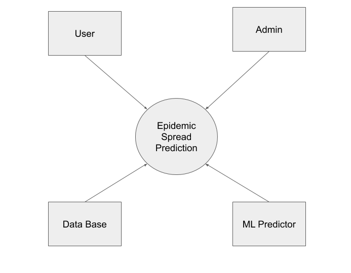
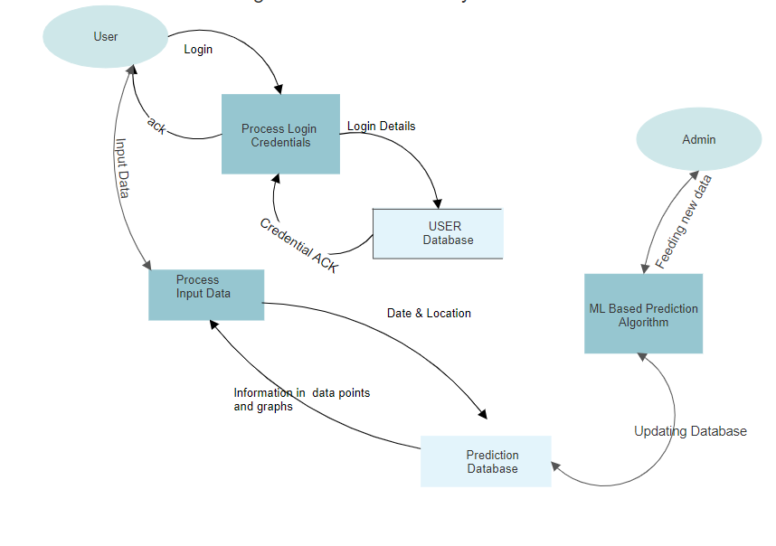

# Coronavirus Prediction

## Overview

The "Coronavirus Prediction" project aims to create a predictive model that forecasts the number of COVID-19 cases country-wise using previously recorded data. This project utilizes various machine learning algorithms and data sources to provide accurate predictions and assist in decision-making processes.

## Table of Contents

- [Overview](#overview)
- [Project Description](#project-description)
- [Functional Requirements](#functional-requirements)
- [Technical Requirements](#technical-requirements)
- [System Analysis and Design](#system-analysis-and-design)
- [Results](#results)
- [Conclusion](#conclusion)
- [References](#references)

## Project Description

The goal of this project is to predict the number of COVID-19 cases in various countries based on historical data. The model prompts users for their location and a timeline, then predicts the number of cases using this input.

### Functional Requirements

1. User authentication.
2. Location and timeline input from the user.
3. Prediction of COVID-19 cases based on historical data.
4. Display of results for user inference and decision-making.

### Technical Requirements

- **Technology**: TensorFlow, Flask
- **Data Sources**: Governmental websites, Google Trends, Google Mobility reports.
- **Languages and Frameworks**: HTML, CSS, JavaScript, Bootstrap for web development; Python for machine learning models.

### Technical Architecture

The project leverages TensorFlow for the machine learning models and Flask for serving the model predictions through a web interface.

## System Analysis and Design

### Requirement Specification

- **Frontend**: HTML, CSS, JavaScript, Bootstrap
- **Backend**: Python, Flask
- **Machine Learning**: TensorFlow, Scikit-learn, Pandas, Matplotlib, SciPy

### Flowcharts and Data Flow Diagrams (DFDs)

The project includes detailed flowcharts and DFDs to illustrate the data processing and prediction workflows.

  
  
<b>Figure 1:</b> COVID-19 Prediction Model Flowchart

  
  
<b>Figure 2:</b> Data Prediction Workflow

  
  
<b>Figure 3:</b> Data Processing Workflow

### Algorithms and Pseudo Code

The prediction model is based on a univariate Long Short-Term Memory (LSTM) network. The following steps outline the algorithm:

1. Data collection from open-source datasets.
2. Data cleaning and preprocessing.
3. Time series data formatting.
4. Model training and evaluation using LSTM.
5. Deployment of the model for user access through a web interface.

## Results

The project successfully predicts the number of COVID-19 cases for specified locations and timelines. The model's performance is evaluated based on its accuracy in predicting future cases.

## Conclusion

Prediction systems are crucial for forecasting future COVID-19 cases in a time-dependent series. This project concludes that a stacked LSTM provides better results than a standard LSTM, enhancing the prediction accuracy.

## References

- [Machine Learning Mastery: LSTM for Time Series Forecasting](https://machinelearningmastery.com/how-to-develop-lstm-models-for-time-series-forecasting/)
- [Kaggle: COVID-19 Projection using LSTM](https://www.kaggle.com/arpandas65/covid-19-projection-using-lstm)

---

**Submitted by:**

- Yash Bitla

**Institution:**
Don Bosco Institute of Technology, Kurla (W), Mumbai-400 070
Department of Computer Engineering

**Academic Year:**
2018-2019
